# Building the dev environment

This section covers the process of building and running the application from your IDE.

🚩 Make sure you have gone through the [IDE Setup Process](ide-setup.md) before following these notes.

Press `Ctrl -> P` 1️⃣ and then `>`and search for `Rebuild`. Select `Dev Containers: Rebuild and Reopen in Container`2️⃣. This will essentially mount your code tree inside a docker container and switch the development context of VSCode to be inside the container where all of the python etc. dependencies will be installed.


If the option above is not visible, you can click on the bell icon in the bottom-right corner (1). 
If the DevContainers extension is already installed, an option to Reopen in Container will appear (2). 
Simply click on this option, and it will automatically build the development containers for you.


Once the task is running, a notification 1️⃣ will be shown in the bottom right of the VSCode window. Clicking in the notification will show you the setup progress 2️⃣. Note that this make take quite a while depending on the internet bandwidth you have and the CPU power of your machine.

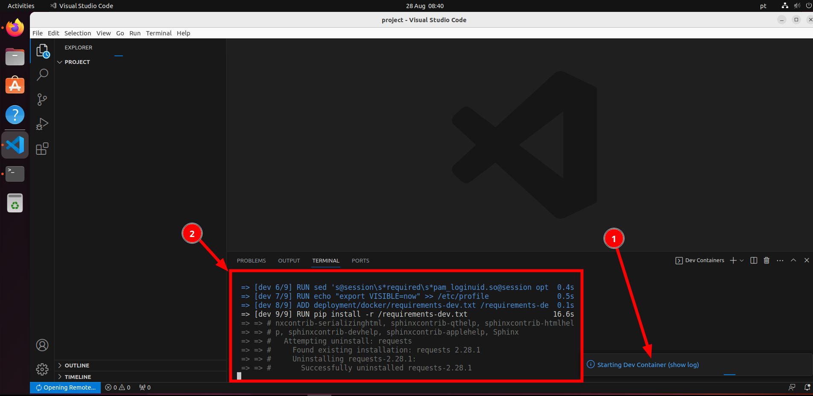

At the end of this process, you will see a message like this:

```
[229365 ms] Port forwarding 53251 > 46727 > 46727 terminated with code 0 and signal null.
```

Once you see that, you can continue the next step below.<br>
Note that the Port forwarding can changes everytime you deploy, so as long as it says `terminated with code 0 and signal null`, you are done and can continue to next step.

## Open a dev container terminal

Open  terminal within the dev container context by clicking the `+`icon in the terminal pane 1️⃣. The new terminal 2️⃣ will show up in the list of running terminals 3️⃣


## Run django migration

```
cd /home/web/project/django_project
python manage.py migrate
```
## Create super user

```
cd /home/web/project/django_project
python manage.py createsuperuser
```

During this process you will be prompted for your user name (defaults to root), email address and a password (which you need to confirm). Complete these as needed.


## Run application

After completing the steps above, You need to run the app.<br>
Click `Run and Debug` button 1️⃣ and then select `Django + React` 2️⃣. After it is selected, click `Start Debugging` 3️⃣.


After run, it will open 2 tab in the right bottom. React 1️⃣ and Python Debug 2️⃣.
You need to wait Python debug to finish by saying `Quit the server with CONTROL-C.`3️⃣,

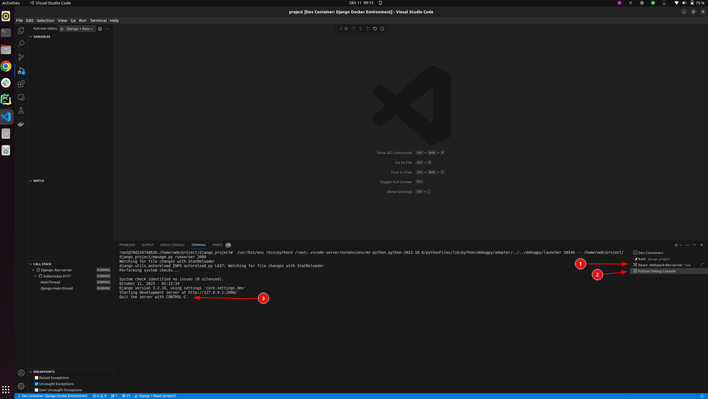

And for React, you need to wait until it shows below message.

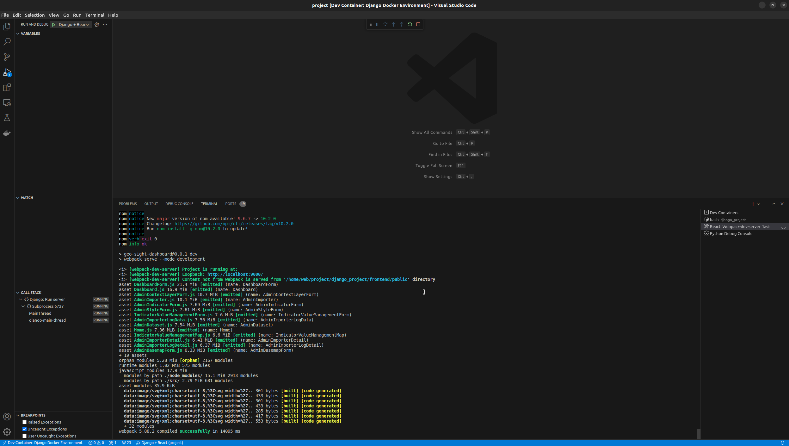


## Viewing your test instance

After completing the steps above, you should have the development server available on port 2000 of your local host:

```
http://localhost:2000
```


The site will be rather bare bones since it will need to be configured in the admin area to set up the theme etc.

## Run demo data

GeoSight has demo data that can be restored.

To restore demo data:
```
cd django_project/
python manage.py loaddata core/fixtures/demo/1.core.json
python manage.py loaddata core/fixtures/demo/2.geosight_georepo.json
python manage.py loaddata core/fixtures/demo/3.geosight_data.json
```
The demo data is using https://georepo.unicef.org/api/v1/, so change the georepo url and it's config to that API.
To change it, do the next step.

## Setup the georepo config

Now to make site working properly, you need to put our georepo config in django admin.

First, you need to login to site.


Put username 1️⃣ and password 2️⃣ based on what you create before on phase `Create super user`

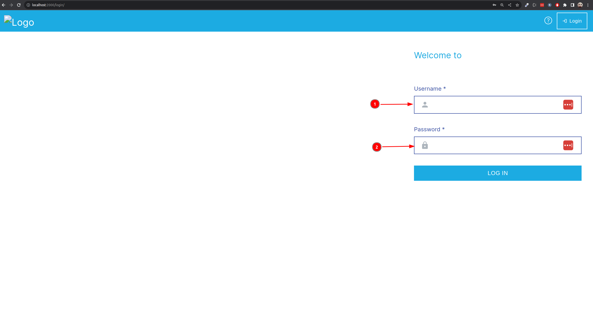

After logged in, click "white circle" on the top-right 1️⃣  and click `django admin`  2️⃣.

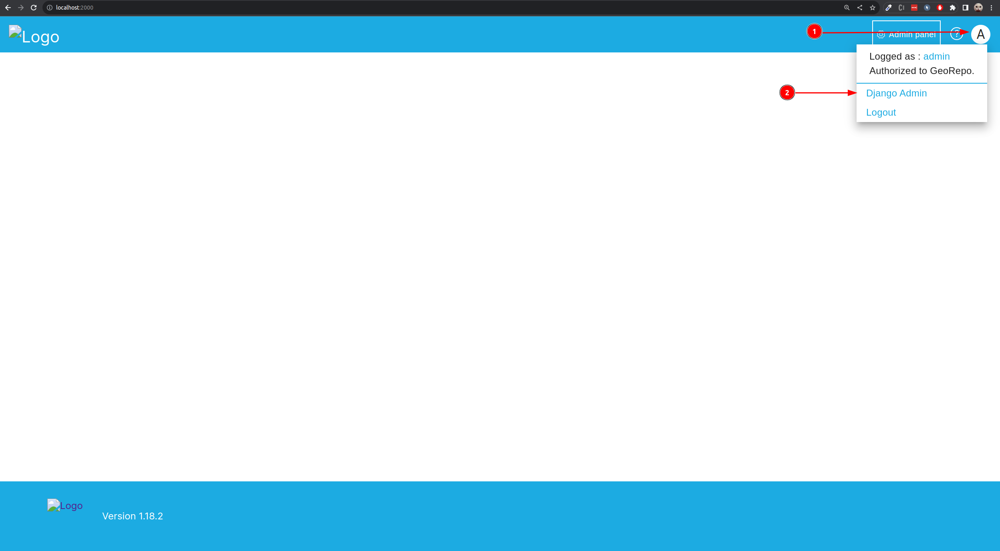

Find `Site preferences` 1️⃣  and click it and find GeoRepo section 2️⃣. Uncheck `Georepo using user api key` if you want to not force user to put their own georepo api key, instead using GeoSight api key 3️⃣.


First you need to decide which georepo instance you are going to use.
Put in Georepo url input with <url georepo>/api/v1

Example, we are going to use https://staging-georepo.unitst.org/
So the GeoRepo url is https://staging-georepo.unitst.org/api/v1


There are 2 types of georepo api key, which is level 1 and level 4.
You can ask georepo admin to provide those 2 key or you can put your own api key for both of those.

To do that, you can go to <your Georepo url>/profile.
In this case, it is https://staging-georepo.unitst.org/profile
And you can check documentation how to generate it.
https://unicef-drp.github.io/GeoRepo-OS/user/api/guide/#generating-an-api-key

One user can just have 1 api key, so for that you can put the same api key to level 1 and level 4.
So, you can fill Georepo api key level 1 and level 4 with your api key 1️⃣  and Georepo api key level 1 email and level 4 email with your email in georepo 2️⃣.

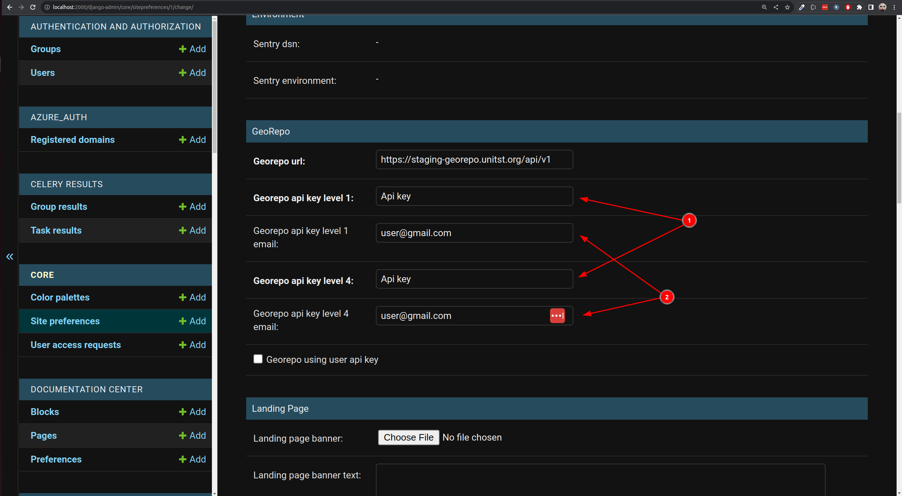

Then click `save` button 1️⃣ in the most bottom of the page and the site is ready.


## Troubleshooting

If you find that the server is keep spinning for a long time like below, here is how to fix it.

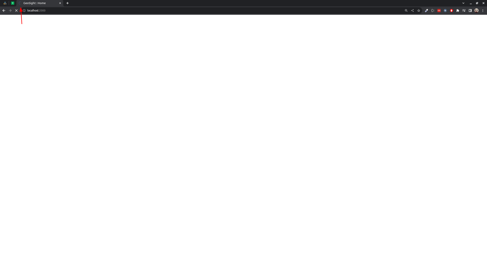

Stop the current run by clicking `stop` button like below image.

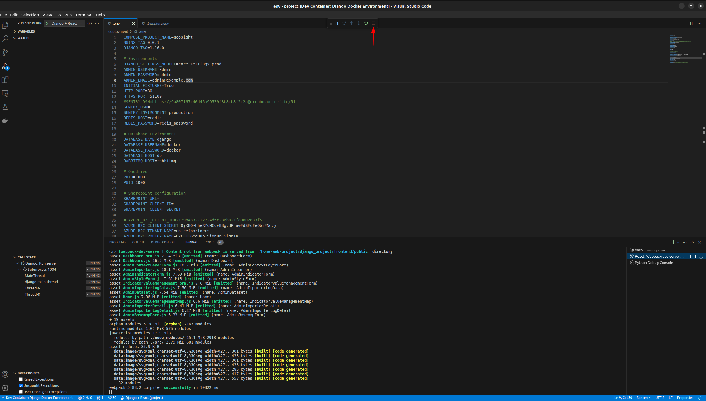

And click `trash` icon in the React tab like below image.

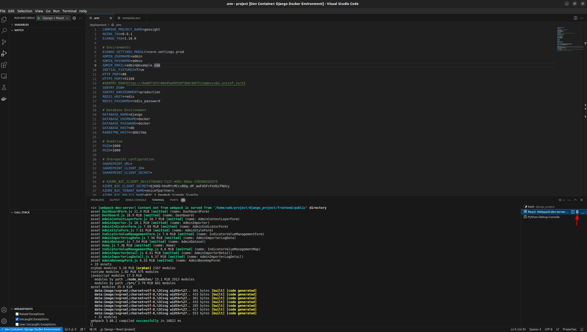


After that, you need to run React and Django one by one.<br>
The idea in here is you need to run React first, wait it is done, after that run Django.

First, you need to run React.<br>
Click `Run and Debug` button 1️⃣ and then select `React: Run webpack-dev-server` 2️⃣. After it is selected, click `Start Debugging` 3️⃣.

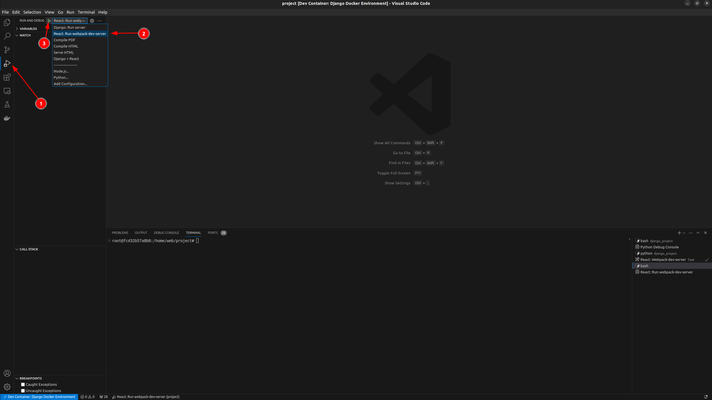

And wait until it shows below message.


After that, you can run django app.
Open new terminal by clicking the `+` 1️⃣ and type the below command 2️⃣ in the terminal.


```
cd /home/web/project/django_project
python manage.py runserver 2000
```

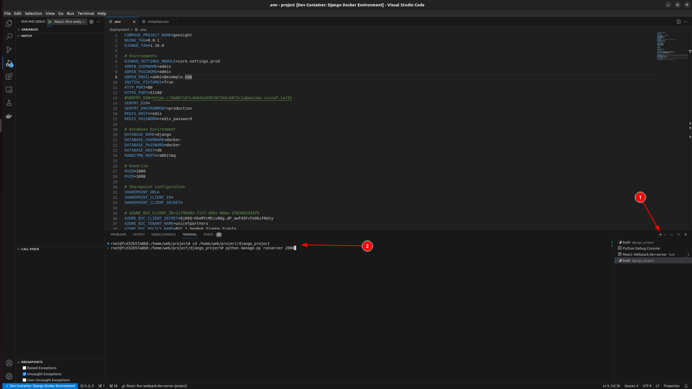

You need to wait until it says `Quit the server with CONTROL-C.`,

After that you can refresh the website.

```
http://localhost:2000
```

But make sure that there is no tab that calling the same url at the first time.
If it is loaded, you can open in multiple tabs.

🪧 Now that you have the built the project, move on to the [Design](design.md) documentation.