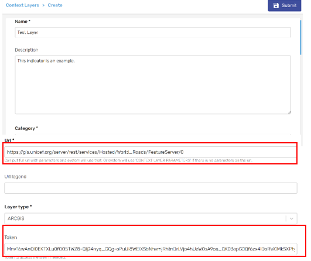

# Context Layers

Context Layers are geospatial information that is not tied to an administrative area. This can include infrastructure information, early warning systems or conflict monitoring that enhance a user's understanding of indicators.

## Creating Context Layers
1.	Navigate to context layer 

2.	Select “Add Context Layer”

3.	Enter a name for the layer

4.	Select a category. 

5.	Paste the API’s URL 

6.	Identify the type of API

    a.	ARCGIS: Hosted on ArcGIS Online or Enterprise. 

    b.	GeoJSON 

    c.	Raster tile 

7.	IF using ArcGIS Online, select the type

    a.	ArcGIS Enterprise

    b.	ArcGIS Online 

8.	Enter permission information (optional).

    a.	Token

    b.	Username

    c.	Password

9. Check the validity of the context layer below. 

    a.	“Map” option displays the visualization of the layer. 

    b.	“Fields and labels” allow you to configure the information displayed

    c.	“Styles” allows you to dictate how the layer appears.

10. Click submit to save the layer.

11. Style, Label and Display options are available in the following tabs. 
	
    Like Indicators, Context Layers can be managed by navigating to the context layer section and clicking on the name of the desired layer.

