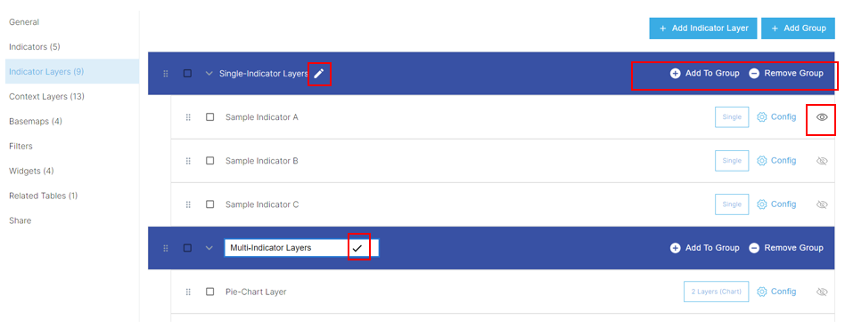

# Creating a Project
The project helps to display context and indicators layers have tools and widgets for performing data analysis on country/regional levels. 
1.	Navigate to the project section under the admin panel. 

2.	Select “Add New Project” 

## General Tab
3.	Complete the General tab.

    a.	Select a reference dataset
        
        i.	This must align with the reference dataset for your indicators (this is the vector layer from GeoRepo). 
    b.	Enter a name

    c.	Define available levels

        i.	This allows users to control what administrative levels can be used. This can limit the display of empty datasets and allow the management of datasets across different scales.
    d.	Define the extent (figure 17)

        i.	Extent- T view you would like the dashboard to open on. 

        ii.	Enter the latitude and longitude for the corners of the extent OR 

4.	Draw a polygon by selecting the pentagon in the top right corner.

## Indicators Tab

5.	Complete the Indicator tab.
    
    a.	This does not display these indicators. 

    b.	Select “Add Indicator”

        i.	Search for the appropriate indicators

        ii.	Click the check box

        iii. Click “Apply selections”. 

        iv.	The number in parentheses shows the number of indicators you’ve selected.

## Indicator Layers Tab

6.	Complete the Indicator Layers tab (figure 17)

    a.	Add individual indicators using the “Add Indicators” button. 

    b.	To group indicators, select “Add Group”. 

        i.	You can name the group by selecting the pencil icon and entering the name in the text box. 

        ii.	You can add indicators to the group by selecting “Add to group” or adding a single indicator and dragging it into the group. 

        iii. Similarly, groups can be nested within one another, but an indicator must be present within a group as well for the group to save
        
The eye symbol  represents the chosen indicator layer that will first visualize when the project is opened.
    
Types of Indicator Layers include:

    a. 	Single Layers are for visualizing single and simple indicators. They are the base type of Indicator Layer, and simply display one dataset and within the chosen reference dataset.

    b.	Multi-Indicator Layers are analysis tools that visualize multiple layer values in proportion to one another via pie or bar charts. 

    c.	When defining this style, users will be prompted to select the desired indicators as well as determine one appropriate color for that indicator. 

    d.	Dynamic Layers are customizable layers that can be created by using a custom expression tailored by user feedback.

    e.	Users will be prompted to define SQL expressions that allow for data to be filtered and selected from other datasets for visualization.

    f.	Related Tables are layers that allow for Splicing and the manipulation of previously uploaded related tables. See Related Tables for more details.

    g.	The Configure option allows for project specific visualization adjustments. This can be useful when the indicator default does not fit your needs.

        i.	General allows users to adjust metadata and available administrative levels.

        ii. Style allows for adjustments to data classifications for the given reference dataset.

        iii. Label allows for the customization of administrative polygon labels.

        iv.	Pop-Up allows users to customize the text box (including data) when a given administrative polygon is selected.

## Context Layers Tab

7.	Complete the context layers tab.
    
    a.	Add individual context layer using the “Add Context Layers” button. 

    b.	To group context layers, select “Add Group”. 

        i.	You can name the group by selecting the pencil icon and entering the name in the text box. 

        ii.	You can add context layers to the group by selecting “Add to group” or adding a single context layer and dragging it into the group. 

        iii.	Similarly, groups can be nested within one another, but a context layer must be present within a group as well for the group to save.

## Basemap Tab

8.	Complete the basemap tab. 

    a.	Basemaps are neither indicators or context layers, but the bottom map that both are imposed over.
        
        i.	These maps show the shapes of landmass and depending on the details, country borders, roads or general information that is not available via an indicator or context layer
    b.	Add individual basemaps using the “Add Basemap” button. 

        Other options include Satellite images and a topographic map

    c.	To group basemap, select “Add Group”. 

        i.	You can name the group by selecting the pencil icon and entering the name in the text box. 

        ii.	You can add basemap to the group by selecting “Add to group” or adding a single basemap and dragging it into the group. 

        iii.	Similarly, groups can be nested within one another, but a basemap must be present within a group as well for the group to save.

        iv.	Use the Open Street Map basemap (OSM) as it shows country borders and when zoomed, local roads. 

## Sharing Tab

9.	Complete the Share Tab to control the sharing and control of access to the project. 

    a.	Allows for permission control for specific users, groups or the general public.

    b.	The permissions are as follows:

        i.	List allows for users to see the presence of a project. 

        ii.	Read allows them to view it. 

        iii.	Write allows them to edit the project and make changes. 

        iv.	Share allows them to control access to the project.
    
        v.	Owner allows complete control, including the ability to delete the project. 

