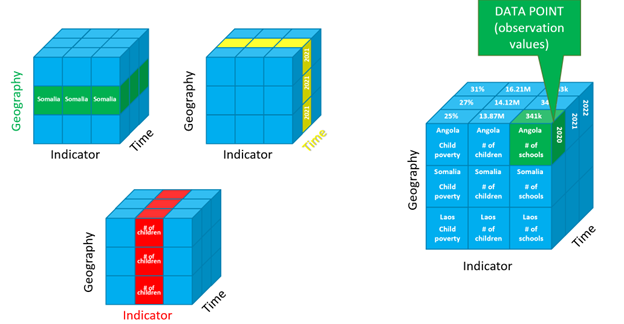

Indicators are a central part of GeoSight, individual pieces of relevant data are uploaded to the platform and in turn are visualized based on location to communicate that information to users. This applies for each dataset, values for the indicator are assigned to the given reference boundaries within the reference dataset.
Indicators are first created as empty shells. A name, color rule and basic information is applied before any data is imported. In pursuit of open data sharing and ease of access, Indicators are formatted so data can exist across multiple dimensions (time and geographical location/reference dataset) within one common indicator as opposed to repeating indicators for separate countries.

Similarly, this prevents the repetition of similar or the same indicators that may be created for different time periods, by users from different Country/Regional Offices. As such users are encouraged to use existing indicators and not create country specific ones. 

To create an indicator
1.	Navigate to the Indicators tab via the Admin Panel. 

    a.	Users can see all existing indicators to search for and manage them. 
2.	Select the Add New Indicator button on the top right.
3.	Complete the Form tab (figure 4)
    
    a.	Enter background on the indicator, including: 

         b.	Name
         c.	Description
         d.	Technical information about the data type. 
         e.	Shortcode

        A shortcode is an abbreviated name that allows for the easy computer-to-computer management of datasets. 

          f. Category 
          g. Indicator type 
              - Integers are for whole 
              numbers without decimals
              - Float allows for different 
              types of numerical data, such as decimals or percentages. 
              - Categories are text values
    A description, data source, unit as well as min and max values are optional.

4.	Complete the Aggregations tab which allows for the summarization of high level sub-national data into larger administrative districts. (optional)

    a.	Check the box “Allow aggregation upper level”.

    b.	Select an option from the Aggregation upper level 

        - COUNT is the number of datapoints (or sub-districts) 
        - SUM is the total of the indicator within the sub-districts 
        - MAX and MIN are the highest and lowest values
        - AVG is the average of the data within the appropriate sub-districts. 
    Aggregation multiple values is for the management of different instances of the dataset over a period of time. 

5. Complete the Style tab (figure 6) to decide how your data is visualized (see Styles for details).

     a.	Either create a custom style, use a pre-made one from the library OR a dynamic style

6.	Complete the Label (figure 7) to create labels for the administrative polygons. (optional)

     a.	Complete the textbox to decide the contents of the label in brackets "{ }".

        "code" = geography code
        "date"= date of data
        "label" = label of data based on
        "name" = geography name
        "value" = value of data

     b.	Complete the above section to change the display of the label including zoom,  color, font style, size, boldness and halo.

7.	Select Save in the top right. 

    a.	This will confirm and save your indicator settings. 
8.	To make changes to an indicator, select the blue name on the main indicator page and the same tabs will appear. (optional)
9.	Batch Editing allows for users to make the same feature changes to multiple indicators at once. 

    a.	Select desired indicators

    b.	Select Batch Edit 

    c.	Determine desired shared changes

    d.	Save
