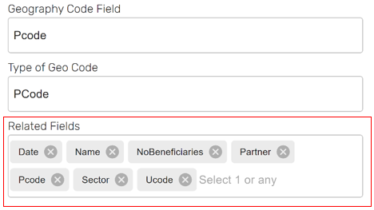
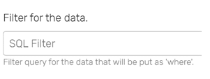
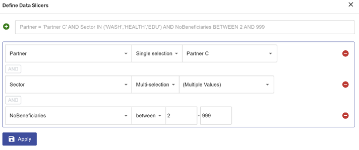

# Related Tables 
Related Tables are disaggregated sheets that span one and/or all of different dimensions including dataset, location and time series. Instead of users sorting these tables and uploading them individually, they can be ingested into GeoSight for more front and back-end malleability. 

## Importing Related Tables
Importing related tables is quite simple and only requires GeoSight to ingest the sheet. In this process, many of the tabs above will not be available.

Follow the steps below to understand the process:
1.	Navigate to the Data Importer in the Admin Panel under Data Management.

2.	Under General select the Import Type as Related Table.

3.	Select the input format (API, SharePoint, Excel, SDMX).

4.	Complete the Attribute tab to connect to the data.

        Via either a local file or pasting the appropriate link

5.	Submit and view your table by navigating to Related Tables tab of the Administrator Page, finding the table and clicking Data.

## Adding Related Tables to Projects
First, users must upload the related table via the import option under Data Management (see above).

Next, users should add related tables to a project so they can then connect to it in order to create a layer via project management.

1.	Navigate to the Related Tables tab under Project Management.

2.	Select Add Related Table and add your table.

3.	Determine the geographical administrative units.

4.	In the Related Fields box, select which fields/columns from your dataset you would like to be enabled so you can incorporate it when adding an indicator. 

        Selected fields will appear in a grey box within the Related Fields space. 

Next, related table indicator layers can be created, like many other features, in the Indicator Layer tab of Project Management.

1.	Select Add Indicator Layer and then Related Table Layer which will bring up the Related Table Layer Pop-up.

2.	Begin completing the pop-up by naming the layer and selecting an SQL Filter and determining their desired expression.

        Users can filter by any attribute, including category, value, or geographic area. 

    

3.	Determine how you want the dataset aggregated

4.	Set color rules (See Styles).

5.	Verify the data is valid and click Apply. 

## Visualizing Point Data from Related Tables

Related tables can also include latitude and longitude (x & y) data that users can visualize as indicators. These related tables can be imported and added as indicator layers are normally imported. 

To configure these point layers, users can determine the configuration of the dataset through adding Related Tables as a context layer (see above).

To create this context layer:

1. Upload the related table via the Importer.
   
2. Create a context layer, setting the layer type as Related Table.
 
3. After selecting the correct table, you’ll be able to determine the latitude (Y) and longitude (X) fields.

4. Once saved, this will be a successfully created layer available to be added as a context layer to a project.
 

## Manipulating Splicers as Indicator Layers

To create multi-Indicator layers, navigate to the Indicator Layer tab under project managemnt 

1.	Select Add Indicator Layer and then Multi Indicators Layer in the pop-up

2.	Complete the filter to select your indicators, it is identical to other layer filters such as time series widgets.

        a. Determine the color by using the color selection tool.

3.	Determine the chart type and size.

        a. Users can display a pie chart or bar chart.

        b. Size can be standardized or flexible.

