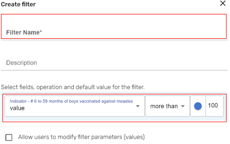
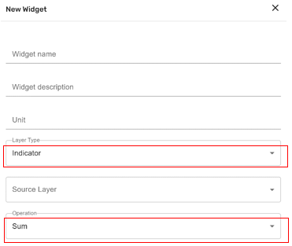
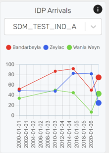

# Widgets and FIlters

Widgets & filters are some of the most powerful tools on GeoSight as they allow for the multi-variate analysis of humanitarian indicators across time and space. They can highlight areas with specific needs, as well as provide various graphs that help to improve the users understanding and comprehension of the data.

## Filters

Filters are a valuable tool that administrators can enable to allow front-end users to only display districts that meet a certain threshold or criteria of an indicator’s values.

### Creating Filters

1. Optionally complete the Filters tab in _Projects_ to allow users to identify and isolate specific administrative areas based on the desired values of an indicator.

    a.	You can create filters by selecting the plus button on the right. 

    b.	Define the operation for the filter

    c.	Connect filters (optional) 

        i.	The AND/OR operation allows you to design filters to identify areas that meet multiple conditions at once, or one or the other. 

## Widgets

Widgets allow users to create summary apps that display the data in a non-geospatial way.

When adding widgets in the project management page, users have quite a few capabilities available to enhance spatial analysis and reasoning.

### Creating Widgets
Optionally, complete the Widgets tab to create data visualization tools that allow for summary information for different indicators. 

1.	Add individual widgets using the “Add Widgets” button (figure 20). 

    a.	Select an indicator and operation to summarize the 

2.	To group widgets, select “Add Group”. 

    a.	You can name the group by selecting the pencil icon and entering the name in the text box.

    b.	You can add widgets to the group by selecting “Add to group” or adding a single widget and dragging it into the group. 

Similarly, groups can be nested within one another, but a widget must be present within a group as well for the group to save. 

#### Summary Group Widget
	The summary group widget is quite similar to a standard widget for a single indicator. However, it enables the analysis of multiple indicators instead of just one. 

##### Creating Summary Group Widgets

1.	Add individual widgets using the “Add Widgets” button.

    a.	Select an indicator and operation to summarize the 

2.	To group widgets, select “Add Group”. 

    a.	You can name the group by selecting the pencil icon and entering the name in the text box.

    b.	You can add widgets to the group by selecting “Add to group” or adding a single widget and dragging it into the group

#### Time Series Widgets

Users can create widgets that display the time series of an indicator to understand how a given value has changed overtime. Importantly, not only can users display this data in a graph, but they can also display the different values on the map as well. By navigating to the time pop-up on the bottom of the dashboard, you can change the date of the data displayed. 

To manage time series widgets, it is important to have multiple instances of data uploaded for a single indicator and reference dataset. This can be completed by importing data. 

By navigating to project management and then the Widgets tab, users can find, add and create these widgets. 

##### Creating Time Series Widgets
When creating these widgets users have a range of capabilities and can filter a variety of aspects for indicators to create either a generalized or highly specific time series. Similarly, they can dictate the display of administrative units and target areas of interest for enhanced analysis. 

1.	When adding a widget, select “Time Series Widget”

2.	The Series option allows you to decide if you would like to display and compare either indicators, or specific geographical areas

The following options allow for you to filter the data and choose what aspects to highlight during the display of your widget.

3.	By selecting the values and then clicking the arrow within the filter, users can determine what indicators, geographical units or time periods to display within the time series widget. 

    a.	Users can control the color via the color selector on the right.

    b.	Syncing “with the current map/dashboard” allows for users to include all indicators, geographical units, or time periods within the map

4.	Click apply to verify the creation of the widget and save the project to complete the creation for end users. 
