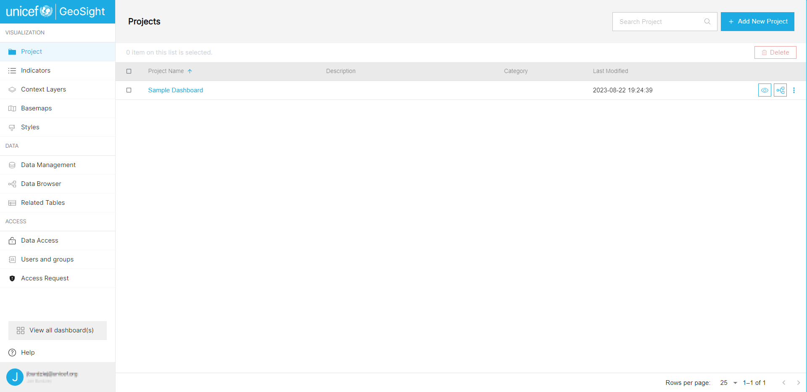

# The Administrator page

The administrator page is your first destination when creating content in GeoSight. It allows managing data, creating projects (dashboards), and managing users.

Users can control any element of data, projects or, layers that they own. Available elements are highlighted in blue text (as opposed to black text).
It is divided into three sections based on function.

## Visualization

1.	Projects - allows control of dashboards, indicator layers and any tools such as widgets and filters.

2.	Indicators - allows users to create, edit and remove indicators.

3.	Context Layers - allows users to create, edit and remove context layers.

4.	Basemap - allows users to create, edit and remove basemaps.

5.	Styles - allows users to create, edit and remove custom styles in the style library.

## Data

1.	Data Management – contains a log of a users current and previous uploads as well as their status. Users are also able to initiate uploads using the Import Data button.

2.	Data Browser – allows for users to look through their datasets and control/adjust values.

3.	Related tables – allow users to upload and manipulate large, disaggregated datasets.

## Access

1.	Data Access – allows for the control of specific indicators and their reference dataset for individual users, groups, or the public.

2.	Users and groups – allows users to add, edit or remove groups or users on GeoSight.

3.	Access Request – users can request increased access and administrative rights.
