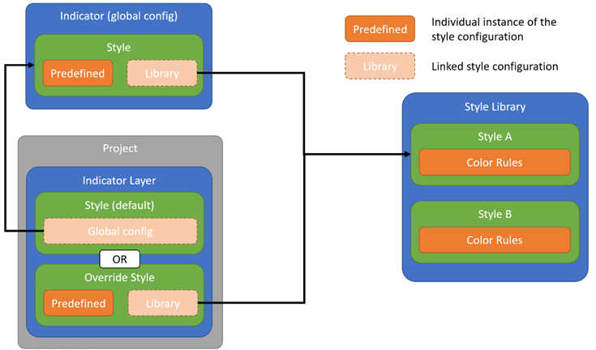

# Styles

Styles can be understood as a dynamic tool that can exist in many different versions across GeoSight. There are three such Individual Instances of style configurations.

1.	Style Library- unassigned color rules that can be applied to any project via the Indicator Layer tab. Can be found by selecting the Style tab in the Admin Panel.

2.	Override Style- the management of style from the Indicator Layer tab, users can manually adjust color rules here.

3.	Indicator Style- the predefined color rules from the indicator management/creation

## Adding Styles and Color Rules
The "Add New Styles" page allows users to add, edit and manipulate styles in the style library that they have access to. Creating a style requires just a few elements, but comes with various customization options.

1.	General – metadata including a name, description, category and value type.

2.	Style Config – where users can either manually define the boundaries of a style OR develop an automatic classification for both quantitative and qualitative values.

3.	Share – allows those with access to control, add and remove permissions for users, groups and the public.
